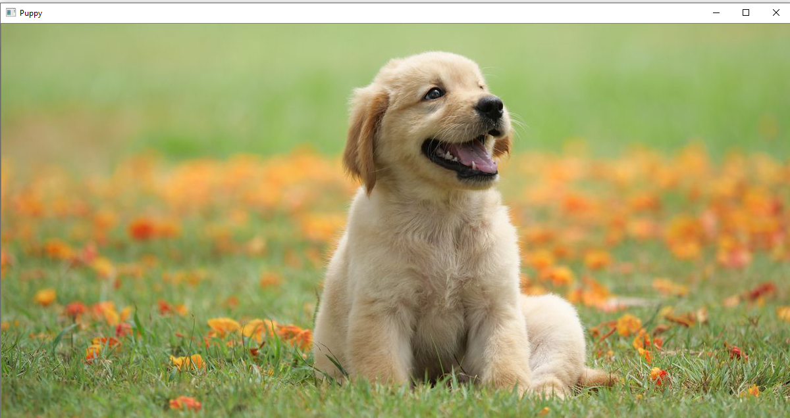
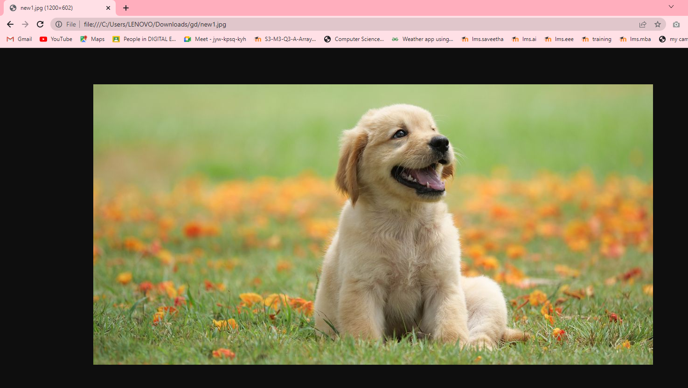
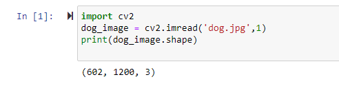
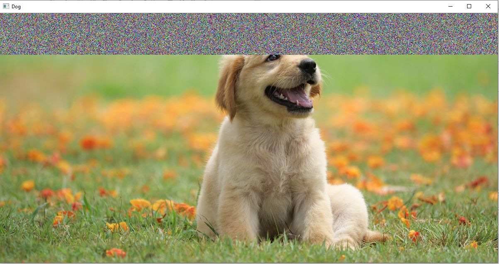
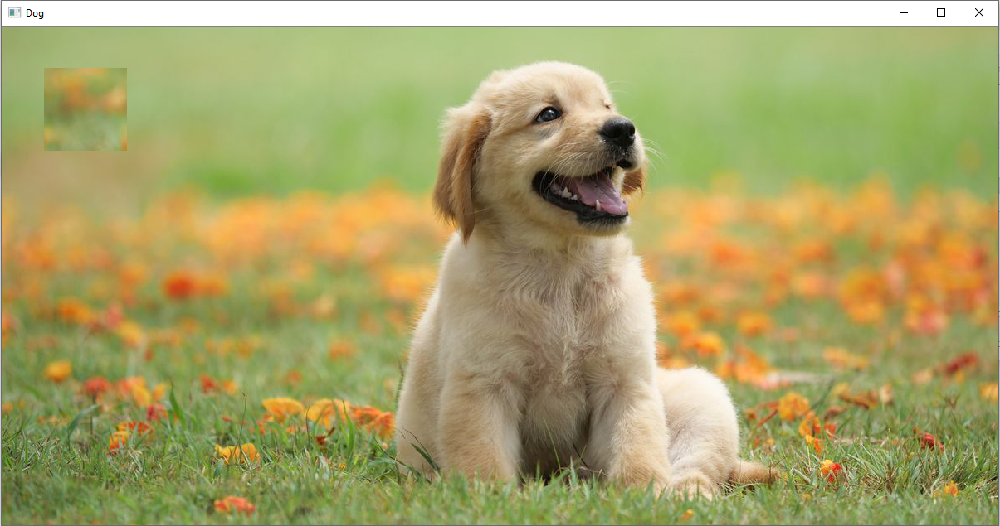

### EX NO : 01
### DATE  : 30.03.2022
# <p align="center"> READ AND WRITE AN IMAGE </p>


## AIM
To write a python program using OpenCV to do the following image manipulations.
i) Read, display, and write an image.
ii) Access the rows and columns in an image.
iii) Cut and paste a small portion of the image.

## Software Required:
Anaconda - Python 3.7
## Algorithm:
### Step1:
Choose an image and save it as a filename.jpg
### Step2:
Use imread(filename, flags) to read the file.
### Step3:
Use imshow(window_name, image) to display the image.
### Step4:
Use imwrite(filename, image) to write the image.
### Step5:
End the program and close the output image windows.
## Program:
```python
# Developed By:
GOWRI M

# Register Number:
212220230019

# To Read,display the image
import cv2
dog_image = cv2.imread('dog.jpg',1)
cv2.imshow('Puppy',dog_image)
cv2.waitKey(0)
destroyAllWindows()


# To write the image
cv2.imwrite('new1.jpg',dog_image)


# Find the shape of the Image
import cv2
dog_image = cv2.imread('dog.jpg',1)
print(dog_image.shape)


# To access rows and columns
import random
for i in range(100):
    for j in range(dog_image.shape[1]):
        dog_image[i][j] = [random.randint(0,255),random.randint(0,255),random.randint(0,255)]
cv2.imshow('Dog',dog_image)
cv2.waitKey(0)
destroyAllWindows()


# To cut and paste portion of image
import cv2
dog_image = cv2.imread('dog.jpg',-1)
tag = dog_image[300:400,300:400]
dog_image[50:150,50:150] = tag
cv2.imshow('Dog',dog_image)
cv2.waitKey(0)
destroyAllWindows()


```
## Output:

### i) Read and display the image

<br>
<br>

### ii)Write the image

<br>
<br>

### iii)Shape of the Image

<br>
<br>

### iv)Access rows and columns

<br>
<br>

### v)Cut and paste portion of image

<br>
<br>

## Result:
Thus the images are read, displayed, and written successfully using the python program.


